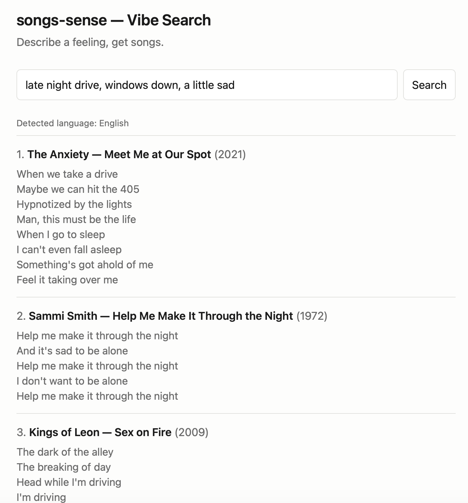

# songs-sense

Search 9,381 songs by how they feel rather than by what they say. Describe a
mood — "late night drive, windows down, a little sad" — and get back songs with
the passage that matched. Built to practise the unglamorous half of retrieval
work: assembling a corpus, chunking it sensibly, and then measuring whether the
search is actually any good instead of assuming it is.

**Live demo — <https://songs-sense.onrender.com>**



The hosted demo runs English-only to keep hosting costs down. Multilingual
retrieval (bge-m3 embeddings, language-aware routing across 4 languages) is
fully implemented and runs behind the `EMBED_MULTILINGUAL` environment flag.

Three retrieval modes exist. **Vibe Search** is the one exposed in the UI.
**Find the Song** (half-remembered lyrics) and **Lyric Twin** (closest real
lyric to any text) are implemented as retrieval profiles and reachable through
`scripts/search.py --mode`, but have no interface.

## How it works

**Corpus.** Six tiers, each from a different source, deduplicated into one seed
list: the Rolling Stone 500 and Billboard GOAT lists, Billboard year-end charts
1960–2019, recent charts 2015–26, ten genre-canonical sets, viral/TikTok-era
tracks, and the full discographies of eight personally chosen artists. The tiers
exist so the corpus is neither purely canonical nor purely current — a vibe
search that only knows classic rock is not interesting.

**Lyrics.** Fetched with a three-source fallback, cheapest and most permissive
first: LRClib, then HuggingFace lyric datasets, then Genius via `lyricsgenius`.
Coverage is **95.0%** (8,914 of 9,381 songs); LRClib alone supplies 84.7%,
Genius 12.8%, HuggingFace 2.5%. The misses are mostly instrumentals, live
versions, and non-Latin-script titles that no source matched.

**Chunking.** Passages are 8 lines with 2 lines of overlap, but the boundary
snaps to a blank line where one falls in the last three lines of the window, so
chunks tend to end at a verse break rather than mid-thought. A trailing chunk
shorter than 4 lines is merged into its predecessor, and anything under 50
characters is dropped. That yields **85,879 passages** — the unit that gets
embedded, retrieved, and shown to the user.

**Embeddings.** Two indexes over the same passages. `bge-base-en-v1.5` (768-d)
covers English; `bge-m3` (1024-d) covers everything else, because an
English-only model embeds Polish lyrics into approximately nowhere. Each column
has its own HNSW index (`m=16`, `ef_construction=64`) with cosine distance.

**Retrieval.** A query is language-detected with `lingua`, routed to the
matching model, and passages in the detected language get a +0.1 similarity
boost. Semantic results can be fused with BM25 — Postgres `tsvector` with
`ts_rank_cd`, using a disjunctive query so half-remembered lyrics still match —
via Reciprocal Rank Fusion (k=60). Each mode picks a profile: Vibe Search and
Lyric Twin are semantic-only, Find the Song is hybrid, since exact words matter
when someone is quoting a lyric badly.

**Languages.** Passages are tagged at ingest:

| en | es | pl | de | ko | pt |
|---|---|---|---|---|---|
| 79.1% | 8.7% | 5.6% | 4.0% | 1.2% | 0.5% |

## Evaluation

The interesting question is not "does it return songs" but "are they the right
songs", so Vibe Search has a reproducible benchmark: 114 curated queries, each
retrieving 10 passages, with every (query, passage) pair graded 0–3 by an LLM
judge. Judgments are cached per prompt version, so re-running against unchanged
retrieval is nearly free.

A judge is only worth its agreement with a human, so 55 pairs were hand-graded
across three rank bands, split into a tuning batch and a held-out batch drawn
from disjoint queries. The tuning batch drove three prompt revisions; the
held-out batch was scored once. Then the tuning batch was re-graded blind — same
pairs, fresh order, original grades hidden — to find out how well the grader
agrees with themselves.

| Comparison | Statistic | Value | n |
|---|---|---|---|
| Judge vs human, held-out | quadratic-weighted kappa | 0.46 | 25 |
| Judge vs human, tuning batch | quadratic-weighted kappa | 0.34 | 30 |
| Human vs self, blind re-grade | quadratic-weighted kappa | 0.42 | 30 |
| Judge vs self, repeated calls | exact-repeat rate | 0.88 | 50 |

**The judge agrees with the grader about as closely as the grader agrees with
themselves.** That is the result worth stating: the ceiling here is human
labelling noise, not the model. Three prompt revisions moved kappa between 0.10
and 0.46 against a target that only reproduces itself at 0.42, and the human
gave a different grade to two-thirds of pairs on second viewing. Read 0.46 as
near the floor of what the task can resolve rather than as a weak judge — and
treat the absolute metrics below as provisional because of it.

| Slice | n | recall@1 | recall@5 | recall@10 | MRR | NDCG@10 |
|---|---|---|---|---|---|---|
| Overall | 114 | 0.50 | 0.82 | 0.89 | 0.63 | 0.80 |
| en | 81 | 0.48 | 0.84 | 0.90 | 0.63 | 0.81 |
| pl | 19 | 0.53 | 0.74 | 0.84 | 0.62 | 0.78 |
| de | 9 | 0.44 | 0.67 | 0.78 | 0.57 | 0.73 |
| es | 5 | 0.80 | 1.00 | 1.00 | 0.90 | 0.88 |

The eval earned its keep by finding a bug no amount of clicking around would
have. The language detector was built with only English, Polish and German, so
every Spanish query was detected as `en` or `pl`, routed to the English-only
model, and boosted toward the wrong language. Adding Spanish moved es from
MRR 0.46 / NDCG 0.71 / recall@1 0.20 to 0.90 / 0.88 / 0.80.

Method, prompt-version history, and how to run the harness: **[docs/evaluation.md](docs/evaluation.md)**.

## Deployment

Postgres with pgvector on Neon, app on Render as a Docker service. Runbook in
[docs/deploy.md](docs/deploy.md).

What English-only costs and saves, concretely: the image bakes only
`bge-base-en-v1.5`, which holds peak memory at 0.75 GB instead of 1.95 GB and
halves the hosted database to 714 MB. Non-English queries still work and the
language is still reported, but they are embedded with the English model and get
no boost, so hosted pl/de/es quality is below what the eval reports. Locally the
flag defaults to true and bge-m3 loads.

A warm search takes ~1.1 s end to end, of which about 1 ms is the vector search
and ~0.16 s is network; the rest is query embedding on a small instance. Cost is
about $25/month for the Render instance plus a few dollars of Neon and Groq
usage.

## Limitations

- The judge sits at the label noise floor, so the absolute metrics are
  provisional. Calibration covers en/pl only — the de and es rows rest on a
  judge never checked against a human in those languages.
- n = 9 (de) and n = 5 (es) are too small to read as language comparisons.
- NDCG@10 uses each query's observed grades as its ideal ranking, the usual
  practical approximation. It flatters queries whose best available result is
  mediocre, which is why NDCG 0.80 sits alongside recall@1 0.50.
- Only Vibe Search is evaluated and exposed. Find the Song and Lyric Twin are
  implemented but unmeasured.
- No reranker, no fine-tuned embeddings, no query rewriting — all deliberate, so
  the baseline measures retrieval rather than a stack of tricks.
- Lyric excerpts in the committed eval files are truncated to two lines; full
  passages exist only in the database.

## Run locally

Requires Docker, Python 3.12 and [uv](https://docs.astral.sh/uv/).

```bash
docker compose up -d                          # Postgres 16 + pgvector on :5432
uv sync
cp .env.example .env                          # fill in DATABASE_URL at minimum
uv run uvicorn src.api.app:app --reload       # http://localhost:8000
```

| Variable | Needed for |
|---|---|
| `DATABASE_URL` | always |
| `EMBED_MULTILINGUAL` | optional; defaults to `true` locally, loading bge-m3 for pl/de/es |
| `GROQ_KEY` | the eval harness only, not the app |

The corpus is not in the repo. Building it from scratch means running the
`src/corpus/`, `src/lyrics/` and `src/embeddings/` scripts against Genius,
Spotify and LRClib, which takes hours and needs API keys.
